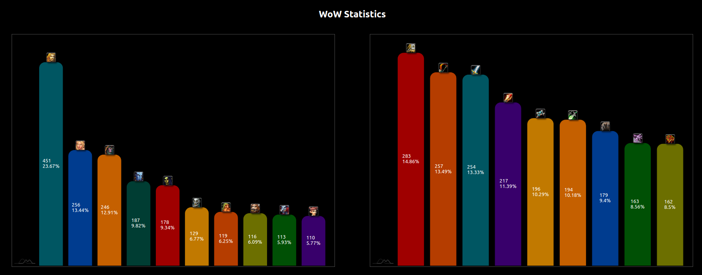

# WoW Statistics

This repository is a collection of React components to display useful information as charts about the server population.

## Internals

This project is built using [Vite](https://vitejs.dev/), a modern build tool that provides a faster development experience compared to traditional bundlers like Webpack.

The chart was done with [AmChart 4](https://www.amcharts.com/) and inspired by [this example](https://www.amcharts.com/demos/column-chart-images-top/?theme=dark).

The application was safely typed with [TypeScript](https://www.typescriptlang.org/).

## How to run

1. Setup .env to your server (check [.env.example](.env.example))
2. Install NPM 10.x and Node 20.x or later via [NVM](https://github.com/nvm-sh/nvm)
3. npm install
4. npm start

Dev/Local profile support is not currently available (see https://github.com/azerothcore/wow-statistics/issues/8), but you can mock data using [this mocked JSON](src/mockData.json).

## Available Commands

In the project directory, you can run:

### `npm start`

Runs the app in the development mode.\
Open [http://localhost:3000](http://localhost:3000) to view it in the browser.

The page will reload if you make edits.\
You will also see any lint errors in the console.

### `npm run build`

Builds the app for production to the `build` folder.\
It correctly bundles React in production mode and optimizes the build for the best performance.

The build is minified and the filenames include the hashes.\
Your app is ready to be deployed!

### `npm run preview`

Previews the production build locally.\
This command serves the build files, allowing you to see how your app will look in production before deploying.

### `npm run lint`

Runs ESLint on the project files with .js, .jsx, .ts, and .tsx extensions and attempts to fix any fixable issues.

### `npm run prettier`

Formats the project files using Prettier. This will apply code style changes to the files.

### `npm run lint:fix`

Runs ESLint to fix issues and then runs Prettier to format the code. This ensures that the code is both linted and formatted.

## How to contribute

- Install Visual Studio Code
- Follow the [conventional commits](https://www.conventionalcommits.org/en/v1.0.0/) guideline
- Commit messages are formatted with [commit-lint](https://commitlint.js.org/#/)
- Code is formatted with Prettier
- Open pull-requests
